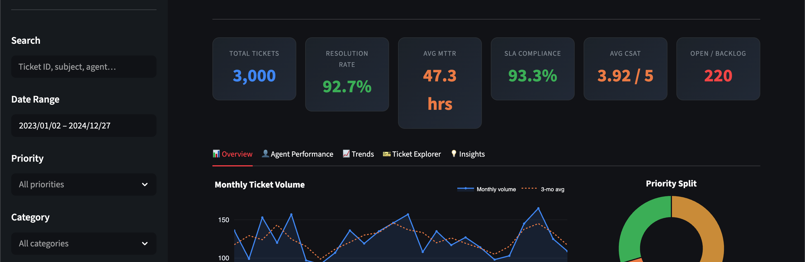

# IT Help Desk Analytics Dashboard

A fully interactive analytics dashboard that tracks, filters, and visualizes IT support ticket data across agents, departments, and time — built with Python, Streamlit, and Plotly.

**🚀 Live Demo:** [panahrahmat-dashboard-project.streamlit.app](https://panahrahmat-dashboard-project.streamlit.app/)



---

## What It Does

This dashboard simulates a real IT help desk environment with 3,000 synthetic tickets spanning two years. It lets you slice the data any way you want using the sidebar filters and immediately see how KPIs, charts, and insights update in real time.

**Key metrics tracked:**
- **MTTR** — Mean time to resolve tickets, broken down by priority and agent
- **SLA Compliance** — Whether tickets were resolved within the SLA target window (4 hrs for P1, up to 7 days for P4)
- **CSAT Score** — Customer satisfaction rating (1–5) per agent and category
- **Backlog** — Count of open, in-progress, and pending tickets

---

## Features

### Sidebar Filters
- Full-text search across ticket ID, subject, agent, department, and category
- Date range picker
- Multi-select filters for Priority, Category, Department, Agent, and Status
- Export filtered data as CSV
- Reset all filters in one click

### Dashboard Tabs

| Tab | What's Inside |
|---|---|
| **Overview** | Monthly volume trend, priority donut, SLA bars, category breakdown, status split, resolution time box plots |
| **Agent Performance** | CSAT bar chart, MTTR vs CSAT scatter plot, color-coded agent leaderboard table |
| **Trends** | Hour-of-day volume, day × hour heatmap, category over time, tickets by department |
| **Ticket Explorer** | Sortable, searchable table with find-on-page, star ratings, row count control |
| **Insights** | Auto-generated callouts, recurring issues table, low CSAT deep dive |

---

## Quick Start

```bash
git clone https://github.com/inquirewithali/it-helpdesk-project.git
cd it-helpdesk-project
pip install -r requirements.txt
python generate_data.py
streamlit run app.py
```

---

## SQL Analysis

`analysis.sql` contains 10 production-style queries compatible with SQLite, PostgreSQL, and DuckDB:

```bash
sqlite3 helpdesk.db
.mode csv
.import data/tickets.csv tickets
.read analysis.sql
```

Queries cover: executive KPI summary, SLA compliance by priority, agent leaderboard, department breakdown, repeat issue detection, hour-of-day staffing patterns, low CSAT deep dive, and backlog aging.

---

## Dataset Schema

| Column | Description |
|---|---|
| `ticket_id` | Unique ID (INC00001–INC03000) |
| `created_at` | Submission timestamp |
| `resolved_at` | Resolution timestamp |
| `category` | Hardware / Software / Network / … |
| `priority` | P1 Critical → P4 Low |
| `status` | Open / In Progress / Pending / Resolved / Closed |
| `department` | Requesting department |
| `assigned_agent` | Handling technician |
| `resolution_hours` | Hours from open to close |
| `met_sla` | Whether SLA target was met |
| `satisfaction_score` | CSAT rating 1–5 |

---

## Project Structure

```
it-helpdesk-project/
├── app.py               # Streamlit dashboard
├── generate_data.py     # Synthetic dataset generator
├── dashboard.py         # Static PNG export
├── analysis.sql         # 10 SQL KPI queries
├── requirements.txt
├── data/
│   └── tickets.csv
└── output/
    └── preview.png
```

*Dataset is fully synthetic — no real user data.*
