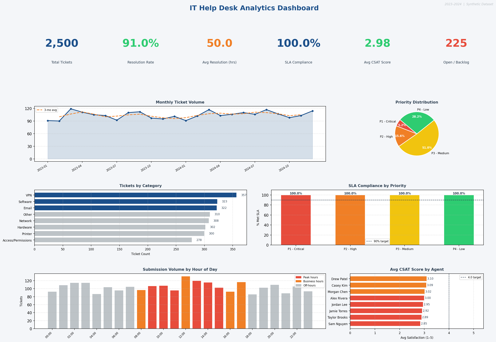

# IT Help Desk Analytics Dashboard

An interactive analytics dashboard for IT support ticket data — built with Streamlit and Plotly. Demonstrates end-to-end data analyst skills: realistic data generation, SQL-style analysis, KPI design, and interactive visualization.



> **Live demo:** `streamlit run app.py` → opens at `http://localhost:8501`

---

## Features

### Interactive Filters (sidebar)
- **Full-text search** — ticket ID, subject, agent name, department, category
- **Date range picker** — any custom window across 2 years of history
- **Multi-select filters** — Priority, Category, Department, Agent, Status
- All charts and KPIs update instantly based on active filters

### KPI Tiles (with trend deltas)
| Metric | Description |
|---|---|
| Total Tickets | Volume in selected period vs. prior period |
| Resolution Rate | % resolved or closed |
| Avg MTTR | Mean time to resolution (hours) |
| SLA Compliance | % of tickets resolved within SLA target |
| Avg CSAT | Customer satisfaction score (1–5) |
| Open / Backlog | Currently unresolved tickets |

### Dashboard Tabs

**Overview**
- Monthly volume trend with 3-month rolling average
- Priority split donut chart
- SLA compliance by priority tier (color-coded vs. 90% target)
- Tickets by category (horizontal bar)
- Status breakdown donut
- Resolution time distribution (box plot by priority, with SLA target lines)

**Agent Performance**
- CSAT score bar chart (color-coded: green ≥ 4.0, orange ≥ 3.5, red < 3.5)
- MTTR vs CSAT scatter plot (bubble size = ticket volume, color = SLA %)
- Sortable agent leaderboard table with color-coded CSAT and SLA columns

**Trends**
- Ticket submission heatmap (day of week × hour of day)
- Hour-of-day volume bar chart (peak hours highlighted)
- Category volume over time (multi-line)
- Tickets by department (bar chart, color = CSAT)

**Ticket Explorer**
- Sortable, filterable table of all tickets
- Sort by any column, choose ascending/descending
- Show 25/50/100/250/500 rows
- Star-rating display for CSAT scores

**Insights**
- Auto-generated written callouts (SLA health, worst category, struggling agents, backlog alerts, volume trends)
- Top 10 recurring issues table
- Low CSAT tickets deep-dive (rated 1–2)

### Export
- **Download CSV** button exports the current filtered dataset

---

## Quick Start

```bash
# 1. Clone and install
git clone https://github.com/YOUR_USERNAME/helpdesk-analytics.git
cd helpdesk-analytics
pip install -r requirements.txt

# 2. Generate the dataset
python generate_data.py
# → data/tickets.csv (3,000 rows, 2 years of realistic patterns)

# 3. Launch the dashboard
streamlit run app.py
# → http://localhost:8501
```

---

## Dataset — Realistic Patterns

The synthetic dataset is not random noise — it has real structure:

- **Monday morning spikes** — more tickets submitted Mon 8–11am
- **Seasonal volume** — Q1/Q4 heavier (onboarding, year-end), summer lighter
- **November hardware surge** — simulates annual equipment refresh
- **Agent performance variance** — agents have distinct speed and CSAT profiles, including one clear underperformer
- **Log-normal resolution times** — realistic skew (most tickets fast, some very slow)
- **Department-agent affinity** — agents are biased toward certain departments

### Agent Profiles

| Agent | Profile |
|---|---|
| Michael Torres | Fast, high CSAT — top performer |
| Christopher Nguyen | Reliable, above average |
| Jennifer Walsh | Solid, finance/legal focus |
| Kevin Chen | Consistent mid-tier |
| David Kim | Average |
| Amanda Brooks | Slightly slow |
| Rachel Patel | Below average CSAT |
| Sarah Rivera | Struggling — low CSAT outlier |

---

## SQL Analysis (`analysis.sql`)

10 production-style queries for SQLite / DuckDB / PostgreSQL:

1. Executive KPI summary
2. Monthly volume trend
3. SLA compliance by priority
4. Category breakdown with resolution time
5. Agent performance leaderboard
6. Department ticket distribution
7. Chronic / repeat issue detection
8. Hour-of-day staffing patterns
9. Low CSAT deep dive
10. Current backlog with age

```bash
sqlite3 helpdesk.db
.mode csv
.import data/tickets.csv tickets
.read analysis.sql
```

---

## Dataset Schema

| Column | Type | Description |
|---|---|---|
| `ticket_id` | string | INC00001–INC03000 |
| `created_at` | datetime | Submission timestamp |
| `resolved_at` | datetime | Resolution timestamp (blank if open) |
| `category` | string | Hardware / Software / Network / … |
| `priority` | string | P1 Critical → P4 Low |
| `status` | string | Open / In Progress / Pending User / Resolved / Closed |
| `subject` | string | Short issue description |
| `department` | string | Requesting department |
| `assigned_agent` | string | Handling technician |
| `resolution_hours` | float | Hours from open to close |
| `met_sla` | boolean | Whether SLA target was met |
| `satisfaction_score` | int | CSAT 1–5 (blank if unresolved) |

## SLA Targets

| Priority | Target |
|---|---|
| P1 – Critical | 4 hours |
| P2 – High | 24 hours |
| P3 – Medium | 72 hours |
| P4 – Low | 168 hours |

---

## Project Structure

```
helpdesk-analytics/
├── app.py               # Streamlit dashboard (main entry point)
├── generate_data.py     # Realistic synthetic dataset generator
├── analysis.sql         # 10 SQL KPI queries
├── requirements.txt
├── data/
│   └── tickets.csv      # 3,000-row dataset
└── output/
    └── dashboard.png    # Static preview image
```

---

*Dataset is fully synthetic — no real user data.*
